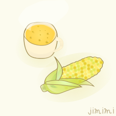

# **Shichibee**

私はHTML-CSS講習に**モグリ**で参加しています。

- UEC24
- Ⅱ類 5クラ 25番

## 所属組織

- x680x0同好会(ここの伝手)(https://www.x68uec.org/)
- スポーツチャンバラ同好会(https://www.onewixsite.com/)
- 写真研究部(https://www.uecphoto.club.uec.ac.jp/)

※◯調にもteam411にもVLLにも所属していません

## 所有資格等
- 英検2級
- タイピング技能検定 8級
- 昆布検定